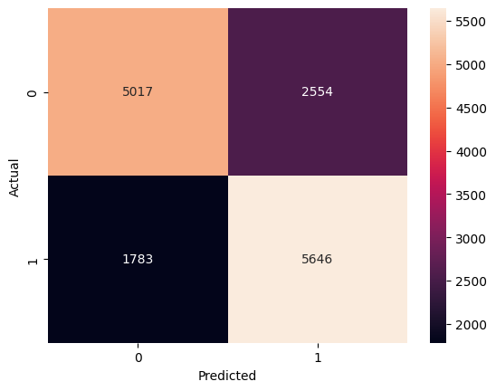
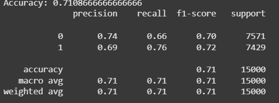

# 🎬 imdb_sentiment_analysis_demo_practice

This is a beginner-friendly machine learning project using the IMDb Sentiment Analysis dataset. The goal is to understand how to build a simple supervised text classification model using logistic regression. This project is part of my journey into AI/ML, and it serves as my first serious step into the field.

---

## 🧠 Project Overview

This project uses a dataset of IMDb movie reviews labeled as positive or negative. We use natural language processing techniques to clean and vectorize the data, then train a logistic regression model to classify the sentiment of new reviews.

- **Dataset Source:** [Kaggle - IMDb Sentiment Analysis](https://www.kaggle.com/code/lakshmi25npathi/sentiment-analysis-of-imdb-movie-reviews/input)
- **Learning Goal:** Apply core ML concepts (data processing, TF-IDF, logistic regression)
- **Tools:** Google Colab, Python, Scikit-learn, Pandas, NLTK

---

## 🧰 Technologies & Libraries

- Python 🐍
- Scikit-learn
- Pandas
- Numpy
- NLTK
- Matplotlib / Seaborn (for optional visualizations)
- Google Colab (as the development environment)

---

## 📁 Dataset Description

The dataset contains two columns:

- `review` – the full text of the IMDb movie review
- `sentiment` – either **positive** or **negative**

We perform basic cleaning (lowercasing, punctuation removal, stopword filtering) before converting the text to numerical form using **TF-IDF vectorization**.

---

## ⚙️ Model Pipeline

1. **Data Loading** – Load the Kaggle dataset into Google Colab  
2. **Preprocessing** – Clean text using basic NLP techniques  
3. **Vectorization** – Apply TF-IDF to convert text to numerical features  
4. **Model Building** – Train a Logistic Regression classifier  
5. **Evaluation** – Measure performance on the test set  
6. **Interpretation** – Analyze common errors and accuracy

---

## 📊 Results

- **Accuracy Achieved:** ~71%
- **Classifier:** Logistic Regression
- **Vectorization:** TF-IDF
- **Train/Test Split:** 70% / 30%

---

## 🖼️ Sample Output

- Confusion matrix
  
-  classification report
  

---

## 📌 Takeaways

- Learned how to clean and vectorize text for sentiment classification
- Built and evaluated a logistic regression model
- Understood the end-to-end ML pipeline from data to deployment

---

## 📎 Getting Started

You can run this project entirely on Google Colab.

### Step 1: Clone this repo
```bash
git clone https://github.com/legendofzer0/imdb_sentiment_analysis_demo_practice.git
```
### Step 2:Run the file
Open the Folders in either Colab or Jupiter Notebooks and run all cell

### Dataset by Lakshmi Narayana Pathi on Kaggle
